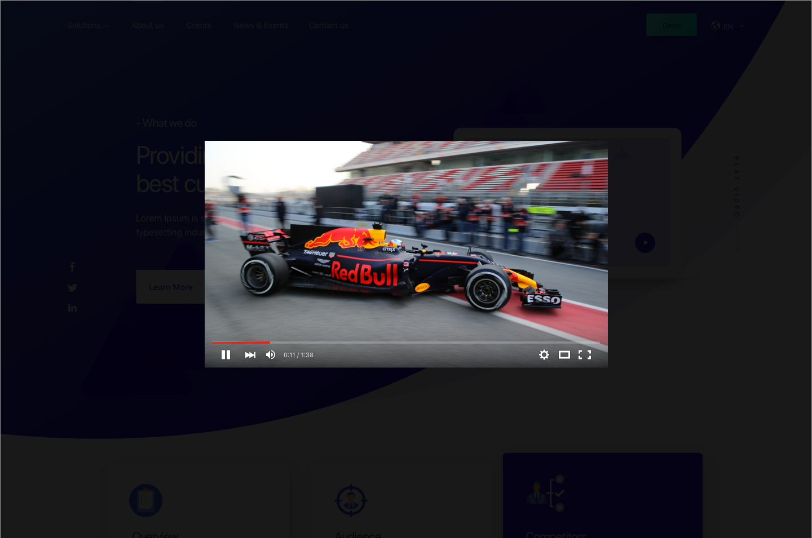

### Teensy js library for embedding responsive modal videos

#### Features
- Simple and light (~1.5kb)
- Responsive video modals
- Hit `Esc` or click outside the modal to exit
- Easily customizable


#### Usage  

##### via npm  
```
npm i video-modal --save
```

##### via <script>  
Add the following line to the bottom of your body tag
```
<script type="text/javascript" src="https://unpkg.com/video-modal"></script>
```

Add the `data-video-id` attribute with the youtube video id to the element that needs to trigger the modal.  

Eg:
```
<a class="btn" href="#" data-video-id="vusqQJ56iIM">Play video</a>
```

#### Customize (Fork and modify)
To further customize the js script, fork the repo and feel free to modify.  
Only modify content that is inside the `src` folder.  

```
gulp build
```
Minifies the files into `dist` directory.